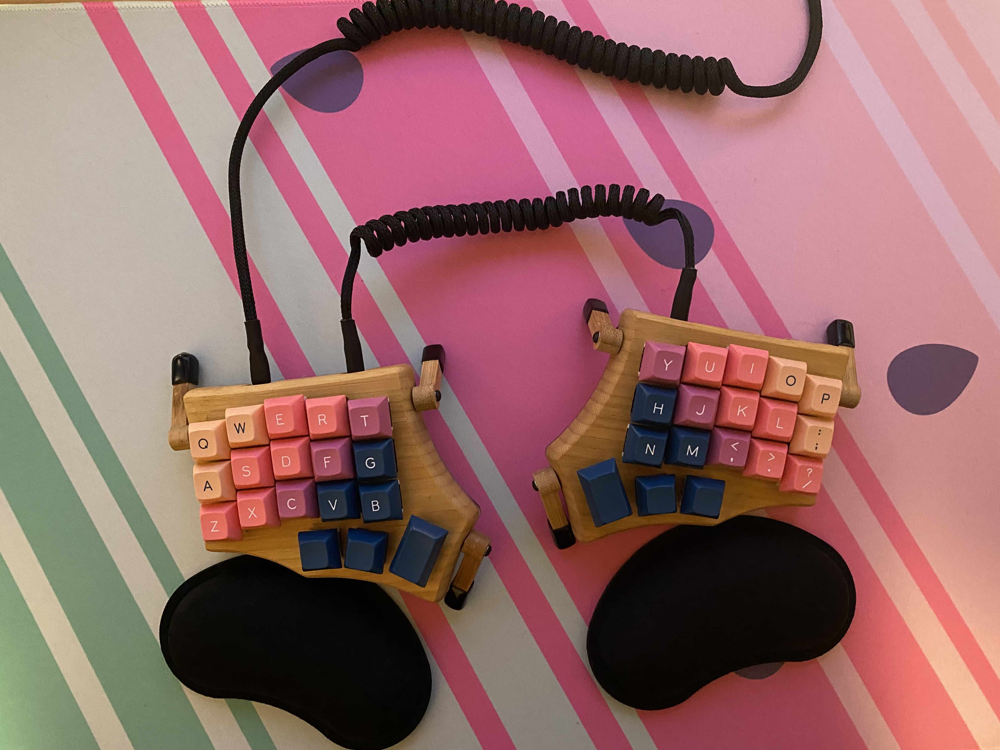

# Minidox



This design originated from Programmer Dvorak and evolved overtime on an
Ergodox. The layout became more simplified and now is in a 36 key form
factor. The original ErgoDox layout can be found [here](https://configure.zsa.io/ergodox-ez/layouts/zLKjG/latest/0).

Dvorak aims to have keys pressed by alternate hands, this idea has
spread throughout this layout. It is the reasoning for brackets being
placed on opposite sides of the board and under dominant fingers on the
home row.

The home row consists of modifier keys. Holding a key will activate a
modifier, tapping will send the normal key. These modifiers are mirrored
on both sides of the keyboard, with the exception of `hyper` being
dedicated the the left side and `meh` being dedicated to the right. Use
`hyper` and `meh` at the operating system level to open specific
programs, this allows for fast application switching. The modifier ordeing 
is as follows: `shift`, `control`, `alt`, `super`. There are stronger 
reasonings to have these placed in a different order based on finger
strength. However, this particular order is based off a traditional
positioning that is found on a Mac based keyboard.

Symbol placement is based on usages in Python and Typescript programming
languages with respect to vim key bindings. There has been intentional
prevention of pressing sequential keys by the same finger (eg `+=` is
completed with a roll). This allows for the next finger in a sequence to
be moved and ready to press the next key. Moving fingers in this way is
more efficient, as moving one finger to press the next key is a major
bottleneck.

## Why 36 keys?

The idea is to restrict finger movement to only `1 unit` away from the
resting position. Creating a more lazy and effortless (physically)
typing experience. Move the keys to the fingers, rather than the fingers
to the keys.

Fingers are rested on the `home` (middle) row, with the thumb rested on
the middle thumk cluster key.

## Vim

Go to begining of line is placed on the left side of the lefthome row: `^`

Go to end of line is placed on the right side of the left home row: `$`

Easily repeat macros with dominant index finger: `@`

Go to next object under cursor with a strong index finger: `*`

Go to previous object under cursor with middle finger: `#`

- Logical ordering would be to have `#` followed by `*`. The reasoning
  this is reversed is due to the original placement of the `*` in
  Programmer Dvorak and the desire to have this action driven by the
  index finger with the `#` placed immediately next to the `*` key. This
  can’t be achieved if the `*` is on the inner index finger column
  because then the same finger must be used to press the next column.
  Therefore, `#` appears after `*`.

Jump to closing bracket: `%`

Start searching: `/`

- Placed towards the top right corner to maintain the desire to stretch
  to start this action

Dedicated escape key for the thumb.

Logical splits with `-` and `|` (horizontal and vertical)

## Other symbols

Dedicated `tmux leader key` to prevent strange contorsions to press
`ctrl-b`. This exists on the symbol layer to easily press consecutive
common keys such as creating a split or moving to another session.

Dedicated `up arrow` key as this is widely used in various applications

- For unix based programs, used `ctrl-p` and `ctrl-n` instead.

## One handed operation

When using a dedicated navigation device such as a track pad or mouse,
we can no longer depend the idea of alternating between halves of the
keyboard. Common actions when using half the keyboard are `copy` and
`paste` during actions driven by the input device. These keys can be
accessed via a left hand chord via the `Function` layer.

Application switching behaviour can be achieved with the left side of
keyboard via `cmd-tab` (home row mod for `u` and outer thumb key).

## Layers

1.  Dvorak

``` text
 
 ,----------------------------------.           ,----------------------------------.
 |   ;  |   <  |   >  |   P  |   Y  |           |   F  |   G  |   C  |   R  |   L  |
 |------+------+------+------+------|           |------+------+------+------+------|
 |   A  |   O  |   E  |   U  |   I  |           |   D  |   H  |   T  |   N  |   S  |
 | SHIFT| CTRL |  ALT | SUPER| HYPER|           | MEH  |SUPER | ALT  | CTRL |SHIFT |
 |------+------+------+------+------|           |------+------+------+------+------|
 |   '  |   Q  |   J  |   K  |   X  |           |   B  |   M  |   W  |   V  |   Z  |
 `----------------------------------'           `----------------------------------'
                ,-----------------------.    ,------,---------------.
                | Esc  | Space   |      |    |      | Enter  | Up   |
                |      |->SYMBOL |      |    |      |->MOUSE |      |
                `----------------| Tab  |    |  Del |--------+------.
                                 |      |    |      |
                                 `------'    `------'
```

2.  Mouse

``` text
 ,----------------------------------.           ,----------------------------------.
 |WhlClk|L Clk | M /\ |R Clk |      |           |      |      |WhlClk|      |      |
 |------+------+------+------+------|           |------+------+------+------+------|
 |Whl /\| M <  | M \/ | M >  |      |           |      |L Clk |Acc 1 |Acc 0 |R Clk |
 |------+------+------+------+------|           |------+------+------+------+------|
 |Whl \/|      |      |      |      |           |      |      |      |      |      |
 `----------------------------------'           `----------------------------------'
                  ,--------------------.    ,------,-------------.
                  |      | PLAY |      |    |      | ENTRY|      |
                  `-------------| NEXT |    |      |------+------.
                                |      |    |      |
                                `------'    `------'
```

3.  Symbol

``` text
 ,----------------------------------.           ,----------------------------------.
 |   `  |   &  |   +  |   =  |   @  |           |   !  |   *  |   #  |   /  |   |  |
 |------+------+------+------+------|           |------+------+------+------+------|
 |   ^  |   [  |   {  |   (  |   $  |           |   _  |   )  |   }  |   ]  |   -  |
 |------+------+------+------+------|           |------+------+------+------+------|
 |   ~  |   \  |   %  |   @  |PASTE |           | Tmux |   !  |L ARW |R ARW |   ?  |
 `----------------------------------'           `----------------------------------'
                  ,--------------------.    ,------,-------------.
                  |->FUNC|      |      |    |      | ->NUM| Down |
                  `-------------|ENTRY |    | Del  |------+------.
                                |      |    |      |
                                `------'    `------'
```

4.  Number

``` text
 ,----------------------------------.           ,----------------------------------.
 |      |      |      |      |      |           |      |   7  |   8  |   9  |      |
 |------+------+------+------+------|           |------+------+------+------+------|
 |      |      |      |      |      |           |      |   4  |   5  |   6  |      |
 |------+------+------+------+------|           |------+------+------+------+------|
 |      |      |      |      |      |           |      |   1  |   2  |   3  |      |
 `----------------------------------'           `----------------------------------'
                  ,--------------------.    ,------,-------------.
                  |      |      |      |    |      | ENTRY|   0  |
                  `-------------|      |    |      |------+------.
                                |      |    |      |
                                `------'    `------'
```

5.  Function

``` text
 ,----------------------------------.           ,----------------------------------.
 |RESET |      |      |      |      |           |      | F7   | F8   | F9   | F10  |
 |------+------+------+------+------|           |------+------+------+------+------|
 |      |      |      |      |      |           |      | F4   | F5   | F6   | F11  |
 |------+------+------+------+------|           |------+------+------+------+------|
 |      |      |      |COPY  |PASTE |           |      | F1   | F2   | F3   | F12  |
 `----------------------------------'           `----------------------------------'
                  ,--------------------.    ,------,-------------.
                  |ENTRY |      |      |    |      |      |      |
                  `-------------|      |    |      |------+------.
                                |      |    |      |
                                `------'    `------'
```
